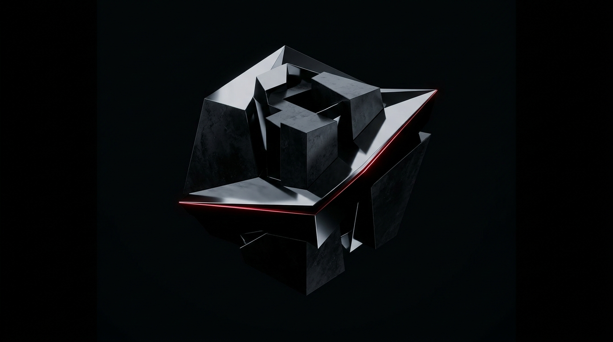
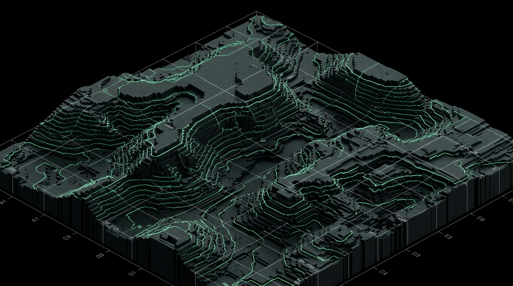
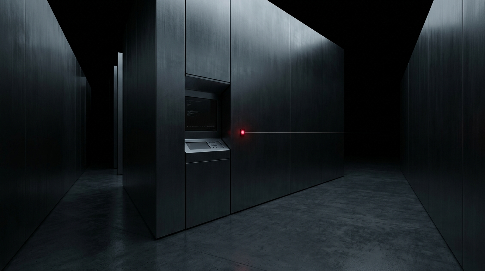
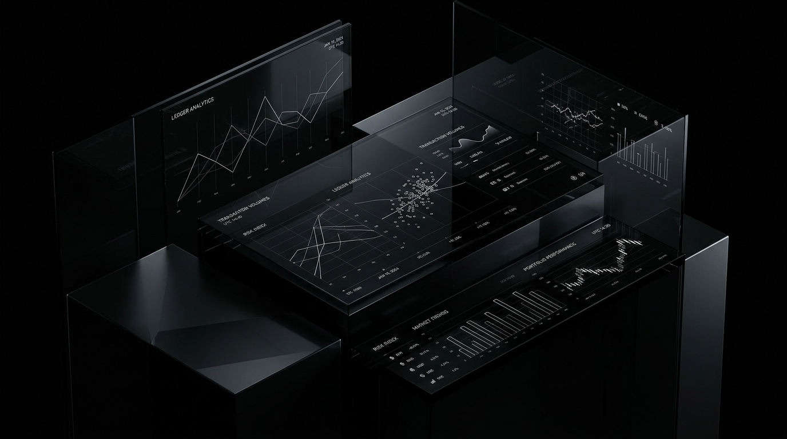
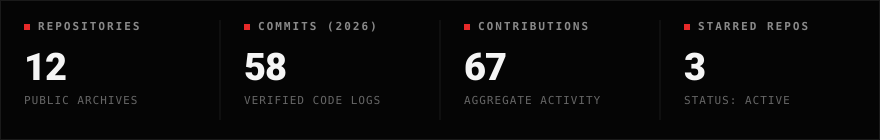
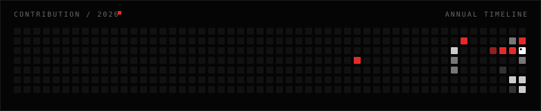

01 / PROFILE &nbsp;·&nbsp; INDIA &nbsp;·&nbsp;  ACTIVE

# ITZPHANTOMGG

### PAARTH
*Developer / Builder / Gamer*

> Building software, interactive experiences and strange ideas that refuse to stay ideas.

 

  

I’m **Paarth**.

I build software, experiment with interactive experiences, work on games, and turn random ideas into functioning projects. I care about the intersection of engineering and experience — making systems that are fast, architectural, and tactile rather than disposable templates.

Based in India. Focusing on systems, WebGL, and local-first computing.

 

---

02 / WORK &nbsp;·&nbsp; SELECTED REPOSITORIES

 

### 01 &nbsp;·&nbsp; 
# MWIS - MINECRAFT WORLD INTELLIGENCE SYSTEM
*Minecraft location management & autonomous cartography, designed around waypoints, organization, and exploration.*

 

 

`TypeScript` &nbsp;·&nbsp; `React 18` &nbsp;·&nbsp; `Three.js` &nbsp;·&nbsp; `IndexedDB` &nbsp;·&nbsp; `Spatial Tool`  
**Status:** Production &nbsp;·&nbsp; 100% Local-First Architecture  

[ **View Repository →** ](https://github.com/Itzphantomgg/MWIS-Minecraft-World-Intelligence-System)

  

### 02 &nbsp;·&nbsp; 
# VOID//OS
*An experimental psychological horror investigation and simulated operating system.*

 

 

`TypeScript` &nbsp;·&nbsp; `React` &nbsp;·&nbsp; `Tailwind CSS` &nbsp;·&nbsp; `Web Audio` &nbsp;·&nbsp; `Interactive ARG`  
**Status:** Release v1.3.0 &nbsp;·&nbsp; 12 Branching Resolutions  

[ **View Repository →** ](https://github.com/Itzphantomgg/VOIDOS)

  

### 03 &nbsp;·&nbsp; 
# VAULT
*Zero-knowledge cryptographic password chamber engineered with real-time 3D mechanics.*

 

 

`TypeScript` &nbsp;·&nbsp; `React 18` &nbsp;·&nbsp; `Three.js / R3F` &nbsp;·&nbsp; `Web Crypto API` &nbsp;·&nbsp; `Systems`  
**Status:** Production Build &nbsp;·&nbsp; AES-256-GCM / PBKDF2  

[ **View Repository →** ](https://github.com/Itzphantomgg/Vault---Password-Manager)

  

### 04 &nbsp;·&nbsp; 
# EXPENSE TRACKER
*Minimalist personal finance dashboard focused on data clarity, ledger analytics, and spending trends.*

 

 

`JavaScript` &nbsp;·&nbsp; `React` &nbsp;·&nbsp; `Tailwind CSS` &nbsp;·&nbsp; `Chart.js` &nbsp;·&nbsp; `Analytics`  
**Status:** Active &nbsp;·&nbsp; Client-Side Persistence  

[ **View Repository →** ](https://github.com/Itzphantomgg/ExpenseTracker)

 

---

03 / STACK &nbsp;·&nbsp; CURATED CAPABILITIES

 

**LANGUAGES**  
`Python` &nbsp;·&nbsp; `Java` &nbsp;·&nbsp; `C` &nbsp;·&nbsp; `C++` &nbsp;·&nbsp; `JavaScript` &nbsp;·&nbsp; `TypeScript`

 

**WEB & INTERFACES**  
`HTML5` &nbsp;·&nbsp; `CSS3` &nbsp;·&nbsp; `React` &nbsp;·&nbsp; `Three.js / WebGL` &nbsp;·&nbsp; `Tailwind CSS`

 

**SYSTEMS & DATA**  
`Windows` &nbsp;·&nbsp; `Linux` &nbsp;·&nbsp; `MySQL` &nbsp;·&nbsp; `IndexedDB` &nbsp;·&nbsp; `Supabase`

 

**TOOLS & ENVIRONMENT**  
`Git` &nbsp;·&nbsp; `GitHub` &nbsp;·&nbsp; `VS Code` &nbsp;·&nbsp; `Vite`

 

---

04 / ACTIVITY &nbsp;·&nbsp; CODE TELEMETRY

 

  

  

 

---

05 / CURRENTLY &nbsp;·&nbsp; FOCUS

 

**BUILDING**  
Interactive web experiences, spatial tools, and local-first applications.

 

**LEARNING**  
Low-level systems programming, data structures, and advanced WebGL shader architectures.

 

**EXPLORING**  
Game mechanics, autonomous tools, and unconventional digital interfaces.

 

---

06 / CONNECT &nbsp;·&nbsp; DISPATCH

 

Open to software collaborations, open source projects, hackathons, and experimental ideas.

 

[ **GitHub →** ](https://github.com/Itzphantomgg) &nbsp;&nbsp;·&nbsp;&nbsp; [ **Instagram →** ](https://www.instagram.com/itzphantomgg/) &nbsp;&nbsp;·&nbsp;&nbsp; [ **Email →** ](mailto:darkyphantom03@gmail.com)

  

---

**ITZPHANTOMGG** &nbsp;·&nbsp; PAARTH / 2026
